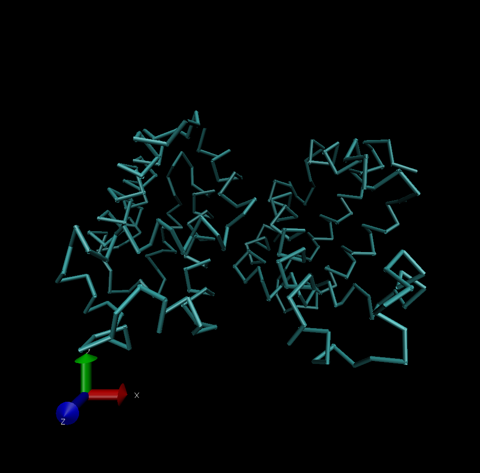

# Assignment 5
ПО: [VMD](http://www.ks.uiuc.edu/Research/vmd/)  
Выбранный белок можно найти [тут](https://www.rcsb.org/structure/7SJI)

## Импорт белка
1. Запустить программу VMD
2. Выбрать пункт ***File -> New Molecule***

3. Выбрать файл с помощью кнопки ***Browse***

4. Нажать ***Load***
5. Для выбора метода отрисовки перейти в ***Graphics -> Respresentations***

6. выбрать метод в разделе ***Drawing Method***

## Визуализация по типам
### 1. Wireframe

### 2. Backbone

### 3. Spacefill

### 4. Ribbons

### 5. Molecular surface

### 6. Schematics

## Визуализация по цветам
### 1. CPK

### 2. Domains

## Publication
